# Vue框架

[2. 创建Vue3工程 | 金山老师的笔记](https://blog.fulfill.com.cn/course/front/vue3/vue3-2.html)

[内置指令 | Vue.js](https://cn.vuejs.org/api/built-in-directives.html#built-in-directives)

[RuoYi 若依官方网站 |后台管理系统|权限管理系统|快速开发框架|企业管理系统|开源框架|微服务框架|前后端分离框架|开源后台系统|RuoYi|RuoYi-Vue|RuoYi-Cloud|RuoYi框架|RuoYi开源|RuoYi视频|若依视频|RuoYi开发文档|若依开发文档|Java开源框架|Java|SpringBoot|SrpingBoot2.0|SrpingCloud|Alibaba|MyBatis|Shiro|OAuth2.0|Thymeleaf|BootStrap|Vue|Element-UI||www.ruoyi.vip](https://ruoyi.vip/)


## 环境安装

- ### VsCode 最新

- Nodejs   18.20+

# 创建项目

```shell
## 1.创建命令
npm create vue@latest


#2 进入到项目目录
cd vue3-ts-vite
# 3 安装npm的包
npm install   --registry=https://registry.npmmirror.com
#4 启动项目 
npm run dev

```

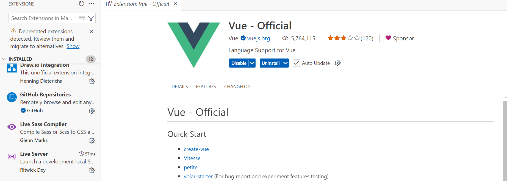

# 项目目录


```
025/06/23  09:38    <DIR>          assets    			放置二进制文件   图片视频等
2025/06/03  14:30               329 index.html			首页，
2025/06/03  14:30               116 jsconfig.json		工程化的配置文件
2025/06/23  09:40    <DIR>          node_modules		第三方依赖
2025/06/23  09:17           164,837 package-lock.json
2025/06/23  09:12               409 package.json        定义项目信息
2025/06/23  09:12    <DIR>          public              公共文件
2025/06/23  09:38               493 README.md
2025/06/23  09:12    <DIR>          src					源代码
2025/06/23  09:12               379 vite.config.js      vite配置配置文件 （webpack）
```

```
2025/06/23  09:38    <DIR>          ..
2025/06/03  14:30             1,372 App.vue				第一个启动画面
2025/06/23  09:12    <DIR>          assets
2025/06/23  09:12    <DIR>          components
2025/06/03  14:30               242 main.js            启动入口
2025/06/23  09:12    <DIR>          router
2025/06/23  09:12    <DIR>          stores
2025/06/23  09:12    <DIR>          views
               2 个文件          1,614 字节
```

# 修改页面逻辑

- 登录画面
- 首页

# 使用ElementPlus

[Overview 组件总览 | Element Plus](https://element-plus.org/zh-CN/component/overview.html)

安装

```shell
D:\workspace\code\vue-project>npm install element-plus --save

added 24 packages in 4m

50 packages are looking for funding
  run `npm fund` for details

D:\workspace\code\vue-project>

```

修改main.js

```javascript
// import './assets/main.css'

import { createApp } from 'vue'
import { createPinia } from 'pinia'

import App from './App.vue'
import router from './router'


// 导入 
import ElementPlus from 'element-plus'
import 'element-plus/dist/index.css'


const app = createApp(App)


// 让ElementPlus生效
app.use(ElementPlus)


app.use(createPinia())
app.use(router)

app.mount('#app')


```

## 自作了首页


# 使用菜单

```
 <el-sub-menu index="1">
          <template #title>
            <el-icon><location /></el-icon>
            <span>系统管理</span>
          </template>
          <el-menu-item-group >
            <el-menu-item index="1-1">用户管理</el-menu-item>
            <el-menu-item index="1-2">角色</el-menu-item>
          </el-menu-item-group>
          <el-menu-item-group title="Group Two">
            <el-menu-item index="1-3">item three</el-menu-item>
          </el-menu-item-group>
          <el-sub-menu index="1-4">
            <template #title>item four</template>
            <el-menu-item index="1-4-1">item one</el-menu-item>
          </el-sub-menu>
        </el-sub-menu>
        <el-menu-item index="2">
          <el-icon><icon-menu /></el-icon>
          <span>Navigator Two</span>
        </el-menu-item>
        <el-menu-item index="3" disabled>
          <el-icon><document /></el-icon>
          <span>Navigator Three</span>
        </el-menu-item>
        <el-menu-item index="4">
          <el-icon><setting /></el-icon>
          <span>Navigator Four</span>
        </el-menu-item>
      </el-menu>
```

## 封装成Vue组件

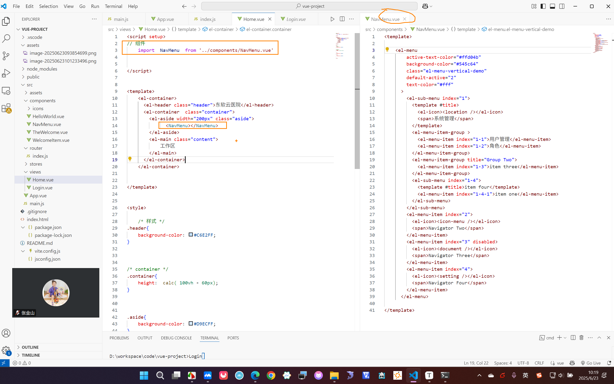

# 定义子路由

修改的 router/index.js

```
import { createRouter, createWebHistory } from 'vue-router'

const router = createRouter({
  history: createWebHistory(import.meta.env.BASE_URL),
  routes: [
    {
      // http://localhost:5173/
      path: '/',
      name: 'home',
      component: ()=> import('../views/Home.vue'),
      // 子路由
      children:[
         // http://localhost:5173/user
        {
          path:'/user',
          name: 'user',
          component: ()=> import('../views/user/index.vue'),
        },
        // http://localhost:5173/role
        {
          path:'/role',
          name: 'role',
          component: ()=> import('../views/role/index.vue'),
        }

      ]
    },
    // http://localhost:5173/login
    {
      path: '/login',
      name: 'login',
      component: () => import('../views/Login.vue'),
    },
  ],
})

export default router

```

## 定义路由中使用的 Vue组件

- user/index.vue
- role/index.vue

- 修改菜单的  index属性 指向router 对应的pat
- 启动 路由    router
- 查看属性 [Menu 菜单 | Element Plus](https://element-plus.org/zh-CN/component/menu.html#menu-attributes)


# 表单与表格：

修改vue

- [Table 表格 | Element Plus](https://element-plus.org/zh-CN/component/table.html#table-表格)
- [Form 表单 | Element Plus](https://element-plus.org/zh-CN/component/form.html#form-表单)

```vue
<template>


<el-form :model="form" label-width="auto" style="max-width: 600px" :inline="true" >
    <el-form-item label="用户名">
      <el-input v-model="form.usernamername" />
    </el-form-item>
   
   
    <el-form-item>
      <el-button type="primary" @click="onSubmit">搜索</el-button>
    </el-form-item>

      <el-form-item>
      <el-button type="primary" @click="append">更加数据</el-button>
    </el-form-item>
  </el-form>


  <div>
    <el-table :data="tableData" style="width: 100%">
        <el-table-column prop="username" label="用户名" width="180" />
        <el-table-column prop="name" label="昵称" width="180" />
        <el-table-column prop="address" label="Address" />
    </el-table>
  </div>


</template>


<script setup>
import {ref} from 'vue'


//用于接收表单内容的
let form =ref( {
    username:''
})

//提交数据 到 
function onSubmit(){
    console.log("form",form.value);
    
}

//表格的数据
let tableData = ref([
  {
    username: 'admin',
    name: 'Tom',
    address: 'No. 189, Grove St, Los Angeles',
  },
  {
    username: 'root',
    name: 'Tom',
    address: 'No. 189, Grove St, Los Angeles',
  },
  {
    username: 'super',
    name: 'Tom',
    address: 'No. 189, Grove St, Los Angeles',
  }
 
])


// 模拟数据的变更
function append(){

    console.log("tableData.value",tableData.value);
    
     tableData.value.push({
          username: 'appendUser',
            name: 'Tom',
            address: 'No. 189, Grove St, Los Angeles',
     })
}


</script>
```


# 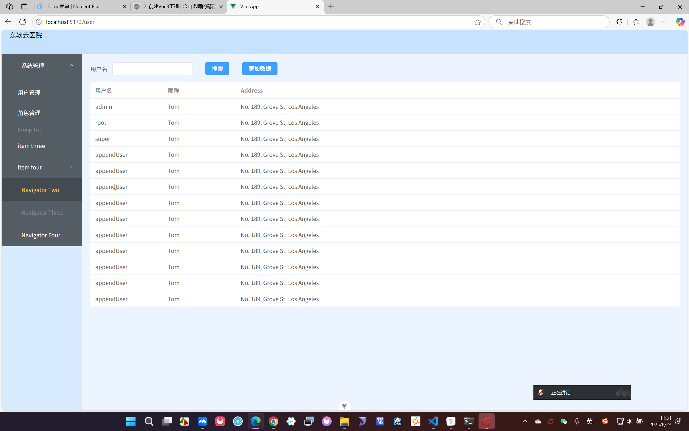常见组件

## 对话框

```vue
<template>


<el-form :model="form" label-width="auto" style="max-width: 600px" :inline="true" >
    <el-form-item label="用户名">
      <el-input v-model="form.usernamername" />
    </el-form-item>
   
   
    <el-form-item>
      <el-button type="primary" @click="onSubmit">搜索</el-button>
    </el-form-item>

      <el-form-item>
      <el-button type="primary" @click="toAdd">添加</el-button>
    </el-form-item>

      <el-form-item>
      <el-button type="primary" @click="append">更加数据</el-button>
    </el-form-item>
  </el-form>


  <div>
    <el-table :data="tableData" style="width: 100%">
        <el-table-column prop="username" label="用户名" width="180" />
        <el-table-column prop="name" label="昵称" width="180" />
        <el-table-column prop="address" label="Address" />
    </el-table>
  </div>


  <!-- 添加表单 dialogFormVisible 表示是否显示，  boolean   -->
  <el-dialog v-model="dialogFormVisible" title="用户的添加" width="500">
    <el-form :model="addForm" label-width="auto"  >
      <el-form-item label="用户名">
        <el-input v-model="addForm.username" />
      </el-form-item>
       <el-form-item label="性别">
        
            <el-radio-group v-model="addForm.gender">
            <el-radio value="1">男</el-radio>
            <el-radio value="2">女</el-radio>
          </el-radio-group>   


      </el-form-item>


        <el-form-item label="省份">

            <el-select
            v-model="addForm.province"  placeholder="请选择省份" size="small"  style="width: 240px"
          >
            <el-option  label="黑龙江1"  value="HLJ1"  />
            <el-option  label="黑龙江2"  value="HLJ2"  />
            <el-option  label="黑龙江3"  value="HLJ3"  />
            <el-option  label="黑龙江4"  value="HLJ4"  />
            <el-option  label="黑龙江5"  value="HLJ5"  />
            <el-option  label="黑龙江6"  value="HLJ6"  />
            <el-option  label="黑龙江7"  value="HLJ7"  />
          </el-select>
        </el-form-item>


        <el-form-item >
              <el-button type="primary">保存</el-button>
      </el-form-item>
    </el-form>


  </el-dialog>


</template>


<script setup>
import {ref} from 'vue'

//是否显示 dialog
let dialogFormVisible = ref(false);

//用于接收表单内容的
let form =ref( {
    username:'',
    gender:1
})


//添加表单
let addForm = ref({
  username:'',
  gender:1,
  province:''
})

//提交数据 到 
function onSubmit(){
    console.log("form",form.value);
    
}

//表格的数据
let tableData = ref([
  {
    username: 'admin',
    name: 'Tom',
    address: 'No. 189, Grove St, Los Angeles',
  },
  {
    username: 'root',
    name: 'Tom',
    address: 'No. 189, Grove St, Los Angeles',
  },
  {
    username: 'super',
    name: 'Tom',
    address: 'No. 189, Grove St, Los Angeles',
  }
 
])


// 模拟数据的变更
function append(){

    console.log("tableData.value",tableData.value);
    
     tableData.value.push({
          username: 'appendUser',
            name: 'Tom',
            address: 'No. 189, Grove St, Los Angeles',
     })
}


function toAdd(){

  dialogFormVisible.value = true;


}


</script>
```

## 循环渲染

- 定义列表数据
- 使用数据
  - v-for： [列表渲染 | Vue.js](https://cn.vuejs.org/guide/essentials/list.html)
  - v-if ：[条件渲染 | Vue.js](https://cn.vuejs.org/guide/essentials/conditional.html)

# 事件

[事件处理 | Vue.js](https://cn.vuejs.org/guide/essentials/event-handling.html#listening-to-events)

# 自定义渲染表格

# 使用消息反馈

- [Message 消息提示 | Element Plus](https://element-plus.org/zh-CN/component/message.html)
- 

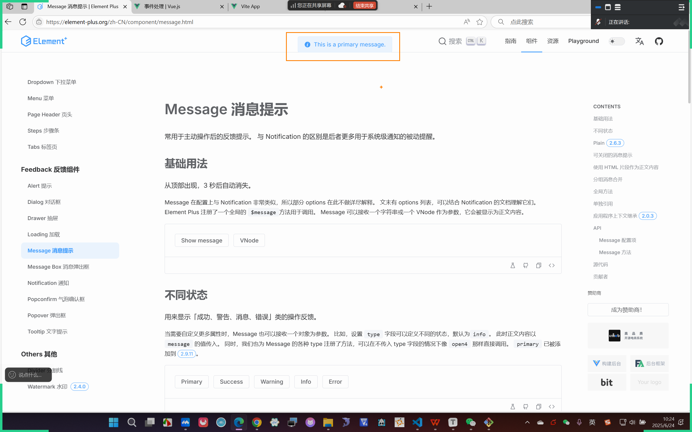


[Notification 通知 | Element Plus](https://element-plus.org/zh-CN/component/notification.html)

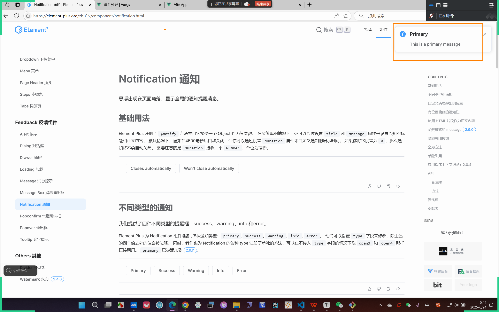

## 使用

- 导入
- 使用

```js
import { ElNotification } from 'element-plus'


// 给与用户反馈
ElNotification({
    title: '提示',
    message: '保存成功!!!!!!!!!!!!!',
    type: 'success',
})
```

# 数据库的安装

管理员身份运行  cmd 在bin目录 执行  `mysqld --install`

```shell
C:\Windows\System32>d:

D:\>cd D:\app\mysql-8.0.30-winx64\bin

D:\app\mysql-8.0.30-winx64\bin>dir
 驱动器 D 中的卷是 Data
 卷的序列号是 08BF-DCEA

 D:\app\mysql-8.0.30-winx64\bin 的目录

2025/01/06  09:50    <DIR>          .
2025/01/06  09:52    <DIR>          ..
2022/07/07  00:01            23,696 echo.exe
2022/07/07  00:01           243,856 fido2.dll
2022/07/07  06:30            54,418 fido2.lib
2022/07/07  00:01         6,418,576 ibd2sdi.exe
2022/07/07  00:01         6,404,768 innochecksum.exe
2022/07/07  00:01           279,704 jemalloc.dll
2022/07/07  00:01         3,452,072 libcrypto-1_1-x64.dll
2022/07/07  00:01         1,850,008 libmecab.dll
2022/07/07  00:01         6,250,664 libprotobuf-debug.dll
2022/07/07  06:14        22,409,216 libprotobuf-debug.pdb
2022/07/07  00:01         1,409,712 libprotobuf-lite-debug.dll
2022/07/07  06:13         4,296,704 libprotobuf-lite-debug.pdb
2022/07/07  00:01           608,936 libprotobuf-lite.dll
2022/07/07  06:29           943,314 libprotobuf-lite.lib
2022/07/07  00:01         2,855,064 libprotobuf.dll
2022/07/07  06:30         3,976,168 libprotobuf.lib
2022/07/07  00:01           118,416 libsasl.dll
2022/07/07  00:01           698,528 libssl-1_1-x64.dll
2022/07/07  00:01         6,345,888 lz4_decompress.exe
2022/07/07  00:01         6,658,712 myisamchk.exe
2022/07/07  00:01         6,502,552 myisamlog.exe
2022/07/07  00:01         6,564,504 myisampack.exe
2022/07/07  00:01         6,542,496 myisam_ftdump.exe
2022/07/07  00:01         7,321,232 mysql.exe
2022/07/07  00:01         7,209,624 mysqladmin.exe
2022/07/07  00:01         7,562,392 mysqlbinlog.exe
2022/07/07  00:01         7,215,256 mysqlcheck.exe
2022/07/07  00:01        52,037,776 mysqld.exe
2022/07/07  06:47       345,755,648 mysqld.pdb
2022/07/07  00:01         7,280,280 mysqldump.exe
2022/07/07  06:12             7,881 mysqldumpslow.pl
2022/07/07  06:12            28,776 mysqld_multi.pl
2022/07/07  00:01         7,201,432 mysqlimport.exe
2022/07/07  00:01         7,710,872 mysqlpump.exe
2022/07/07  00:01         7,199,384 mysqlshow.exe
2022/07/07  00:01         7,218,328 mysqlslap.exe
2022/07/07  00:01         6,299,304 mysql_config_editor.exe
2022/07/07  00:01         7,291,568 mysql_migrate_keyring.exe
2022/07/07  00:01         7,195,832 mysql_secure_installation.exe
2022/07/07  00:01         6,323,368 mysql_ssl_rsa_setup.exe
2022/07/07  00:01         6,231,720 mysql_tzinfo_to_sql.exe
2022/07/07  00:01         7,294,624 mysql_upgrade.exe
2022/07/07  00:01         6,284,968 my_print_defaults.exe
2022/07/07  00:01         7,143,568 perror.exe
2022/07/07  00:01            52,888 saslSCRAM.dll
2022/07/07  00:01         6,250,656 zlib_decompress.exe
              46 个文件    619,025,349 字节
               2 个目录 340,743,696,384 可用字节

D:\app\mysql-8.0.30-winx64\bin>mysqld --install
Service successfully installed.

D:\app\mysql-8.0.30-winx64\bin>


```

```shell
D:\app\mysql-8.0.30-winx64\bin>mysql  -uroot -proot
mysql: [Warning] Using a password on the command line interface can be insecure.
Welcome to the MySQL monitor.  Commands end with ; or \g.
Your MySQL connection id is 8
Server version: 8.0.30 MySQL Community Server - GPL

Copyright (c) 2000, 2022, Oracle and/or its affiliates.

Oracle is a registered trademark of Oracle Corporation and/or its
affiliates. Other names may be trademarks of their respective
owners.

Type 'help;' or '\h' for help. Type '\c' to clear the current input statement.

mysql> show databases;
+--------------------+
| Database           |
+--------------------+
| es_data            |
| his                |
| information_schema |
| mobilebank         |
| mybatis-introduce  |
| mysql              |
| performance_schema |
| sca-master         |
| sys                |
| weather_info       |
| yyzx               |
+--------------------+
11 rows in set (0.01 sec)

mysql>
```

# 使用客户端

- sqlyog

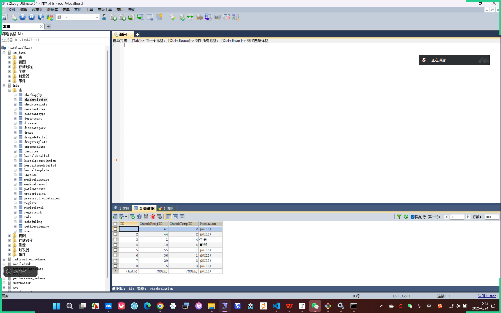

# 搭建Java环境

- JDBC
- ORM    Hibernate（国外）  重量级的 可以不写SQL ，   
- Mybatis   半自动化： 定制SQL 
- MyBaitsPLUS ： [简介 | MyBatis-Plus](https://baomidou.com/introduce/)


## SpringBoot：Spring

SSM    Struts1.x  2.x(MVC)      SpringIOC  Hibernate 

SSM：   Struts1.x  2.x (MVC)     SpringIOC   Mybaits

SSM  SpringMVC  +  Spring(IOC) + Mybatis  

Spring 事实上的行业标准

SpringBoot:  [Spring Boot](https://spring.io/projects/spring-boot)  

SpringFramework： [Web on Servlet Stack](https://docs.spring.io/spring-framework/docs/5.2.25.RELEASE/spring-framework-reference/web.html#spring-web)

## 需要用到

- JDK  17+

- Maven 3.5+

- IDEA   集成开发环境

  

​	

## JDK 17

配置环境变量

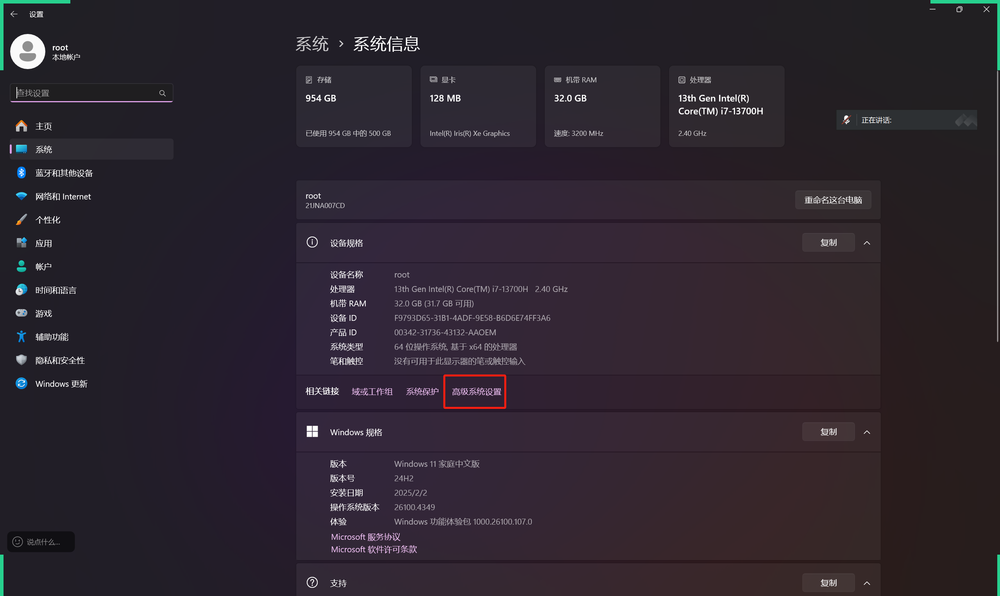

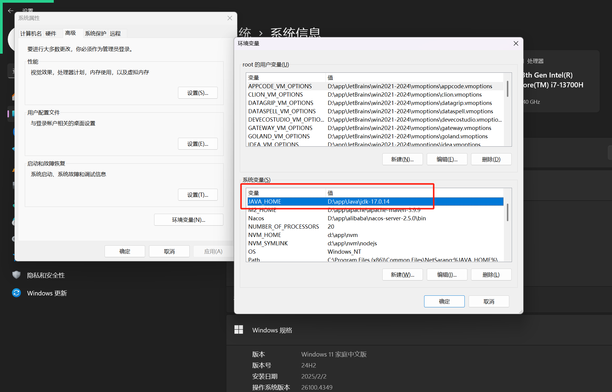


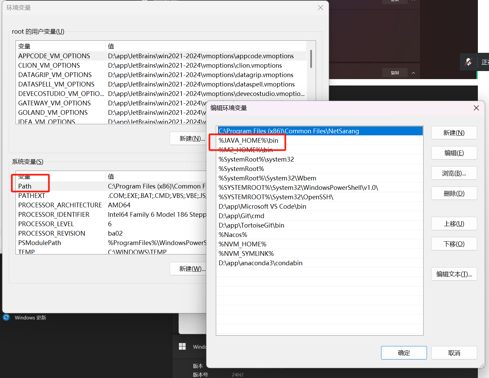


## Maven 

[Welcome to Apache Maven – Maven](https://maven.apache.org/)

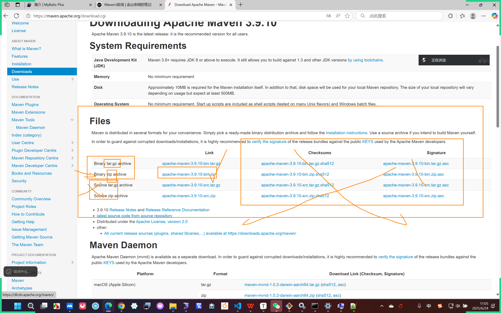

笔记： [Maven3应用 | 金山老师的笔记](https://blog.fulfill.com.cn/course/01-java/maven.html)

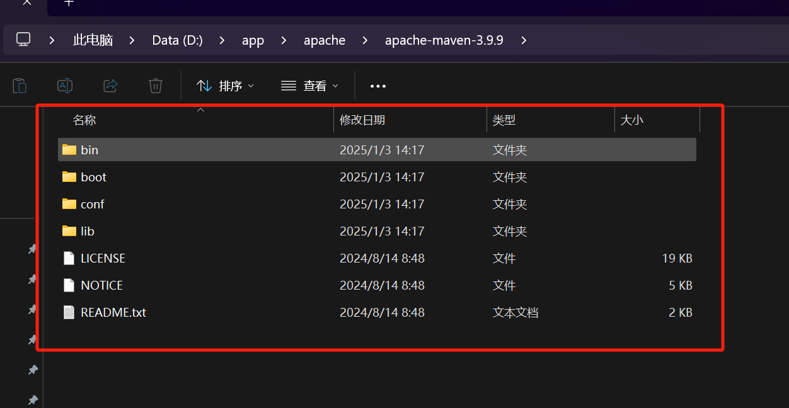

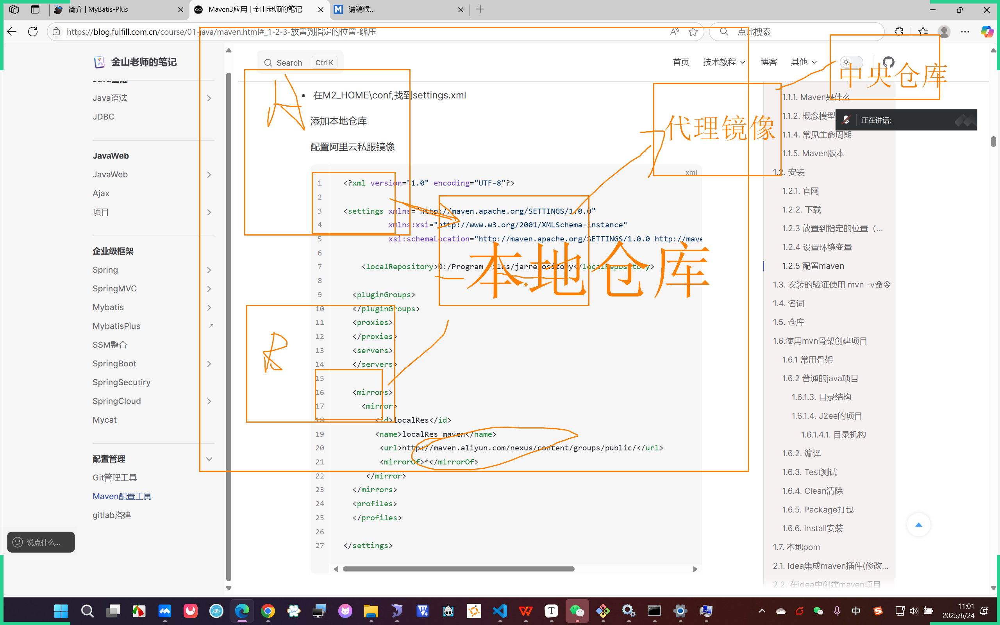


修改settings.xml 

```xml
c<?xml version="1.0" encoding="UTF-8"?>

<settings xmlns="http://maven.apache.org/SETTINGS/1.2.0"
  xmlns:xsi="http://www.w3.org/2001/XMLSchema-instance"
  xsi:schemaLocation="http://maven.apache.org/SETTINGS/1.2.0 https://maven.apache.org/xsd/settings-1.2.0.xsd">


	<!-- 本地仓库 -->
    <localRepository>D:/app/apache/jarrepository</localRepository>
  <pluginGroups>
  
  </pluginGroups>

  <proxies>
 
  </proxies>

  <servers>
 
  </servers>

  <mirrors>
  
  
	<!--镜像仓库 -->
    <mirror>
      <id>aliyun-maven</id>
      <mirrorOf>*</mirrorOf>
      <name>阿里云公共仓库</name>
      <url>https://maven.aliyun.com/repository/public</url>
    </mirror>
  </mirrors>

  <profiles>
   
  </profiles>

</settings>
```

## IDEA 

集成Maven 

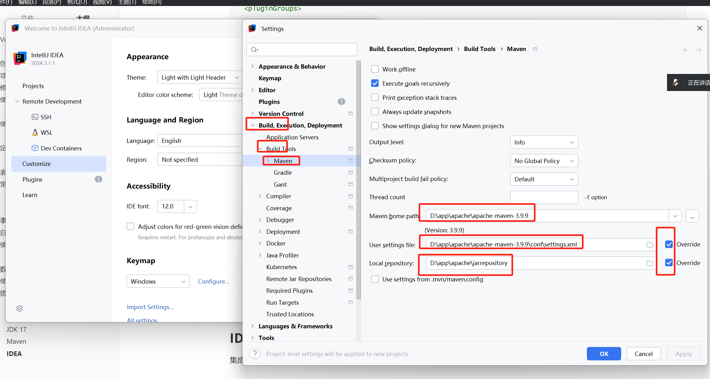


# 创建SpringBoot项目

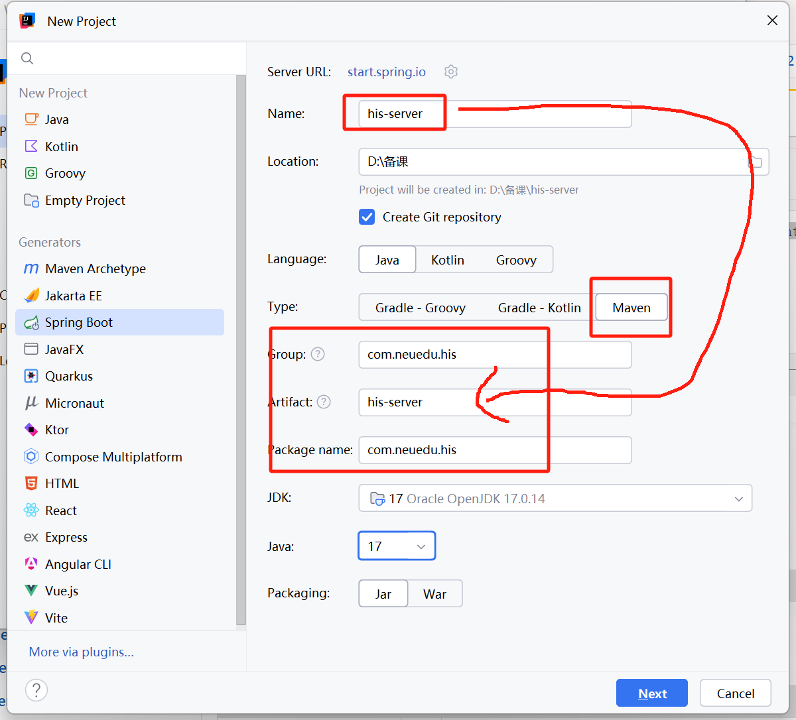

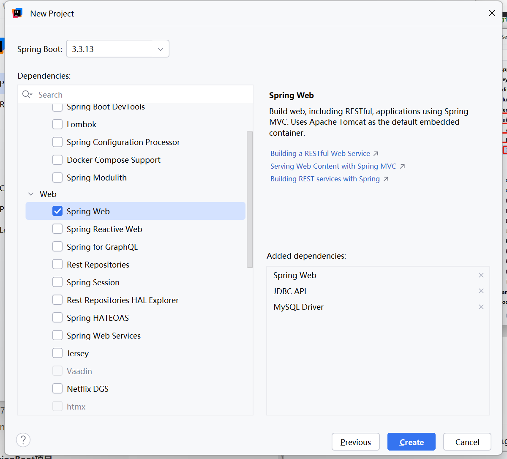


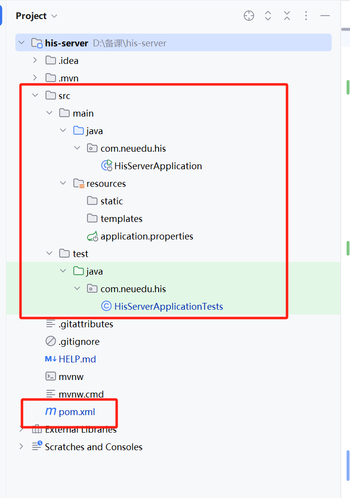


## 编写Controller

```java
package com.neuedu.his.controller;

import org.springframework.web.bind.annotation.RequestMapping;
import org.springframework.web.bind.annotation.RestController;

import java.util.ArrayList;
import java.util.HashMap;
import java.util.List;
import java.util.Map;

/**
 * 作者: 张金山
 * 创建时间：2025/6/24 11:17   星期二
 * 描述： 欢迎信息
 * 项目: his-server - com.neuedu.his.controller
 * 作者的博客:  https://blog.fulfill.com.cn
 */
@RestController
public class IndexController {


    /**
     * 访问  url  ， 获取 数据  json  string:  success
     * http://localhost:8080/index
     * @return
     */
    @RequestMapping("/index")
    public String index(){

        return "success";
    }

    @RequestMapping("/json")
    public List json(){

        List list = new ArrayList();
        for (int i = 0; i < 10; i++) {
            Map row = new HashMap();
            row.put("id", i);
            row.put("name", "name"+i);
            row.put("address", "address"+i);
            list.add(row);
        }
        return list;
    }

}
```

## 测试

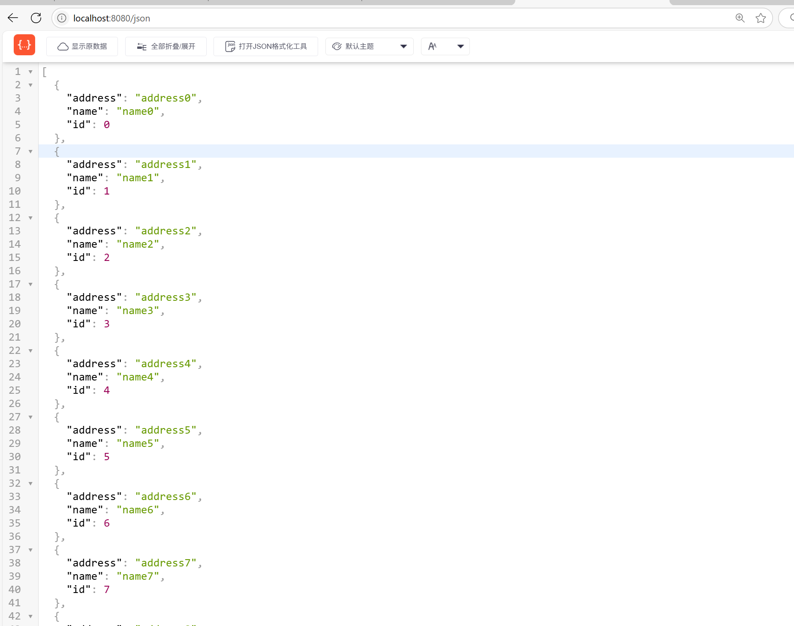


# MyBatisPlus

baomidou.com

[持久层接口 | MyBatis-Plus](https://baomidou.com/guides/data-interface/)

基于SpringBoot框架集成MyBatisPlus。

- 数据库
- 添加依赖
  - 数据库驱动  MySQL
  - MyBatisPlus依赖（jdbc）
  - 事务的概念spring-boot-starter-jdbc 不需要显示的声明
    - 自动配置
      - ？？？
- 配置数据源
  - url
  - username
  - password
  - driverClass
- MVC  三层架构
  - Controller
  - 负责网络请求对接收和响应
  - Service
    - 负责处理业务逻辑
    - 转账的业务
      - 张三   减少
    - 李四   增加
  - Dao  Mapper
    - 通用的CRUD接口

RegistService  继承父类   ResigerDao

## 实际操作

完整的CRUD操作

## 添加依赖

```xml
<?xml version="1.0" encoding="UTF-8"?>
<project xmlns="http://maven.apache.org/POM/4.0.0" xmlns:xsi="http://www.w3.org/2001/XMLSchema-instance"
         xsi:schemaLocation="http://maven.apache.org/POM/4.0.0 https://maven.apache.org/xsd/maven-4.0.0.xsd">
    <modelVersion>4.0.0</modelVersion>
    <parent>
        <groupId>org.springframework.boot</groupId>
        <artifactId>spring-boot-starter-parent</artifactId>
        <version>3.3.13</version>
        <relativePath/> <!-- lookup parent from repository -->
    </parent>
    <groupId>com.neuedu.his</groupId>
    <artifactId>his-server</artifactId>
    <version>0.0.1-SNAPSHOT</version>
    <name>his-server</name>
    <description>SPringBoot项目</description>

    <properties>
        <java.version>17</java.version>
    </properties>


    <!-- 第三方依赖  -->
    <dependencies>
        <!-- webmvc -->
        <dependency>
            <groupId>org.springframework.boot</groupId>
            <artifactId>spring-boot-starter-web</artifactId>
        </dependency>


        <!-- 内置的测试框架 -->
        <dependency>
            <groupId>org.springframework.boot</groupId>
            <artifactId>spring-boot-starter-test</artifactId>
            <scope>test</scope>
        </dependency>


        <!-- MybatisPlus   -->
        <dependency>
            <groupId>com.baomidou</groupId>
            <artifactId>mybatis-plus-spring-boot3-starter</artifactId>
            <version>3.5.12</version>
        </dependency>
        <!-- mysql驱动 -->
        <dependency>
            <groupId>com.mysql</groupId>
            <artifactId>mysql-connector-j</artifactId>
            <scope>runtime</scope>
        </dependency>


    </dependencies>

    <build>

        <!-- 插件  -->
        <plugins>
            <plugin>
                <groupId>org.springframework.boot</groupId>
                <artifactId>spring-boot-maven-plugin</artifactId>
            </plugin>
        </plugins>
    </build>

</project>
```

## 编写数据源

Spring的默认配置文件application.properties   application.yaml  

```
spring:
  # 配置数据源
  datasource:
    url: jdbc:mysql://localhost:3306/his
    username: root
    password: root
    driver-class-name: com.mysql.cj.jdbc.Driver
```

## 使用MapperScan注解

扫描 Mapper所在的包

```java
package com.neuedu.his;

import org.mybatis.spring.annotation.MapperScan;
import org.springframework.boot.SpringApplication;
import org.springframework.boot.autoconfigure.SpringBootApplication;

/**
 * 启动类
 */
@SpringBootApplication
@MapperScan("com.neuedu.his.mapper")
public class HisServerApplication {

    public static void main(String[] args) {
        SpringApplication.run(HisServerApplication.class, args);
    }

}
```

## 定义实体类

[使用配置 | MyBatis-Plus](https://baomidou.com/reference/#mapunderscoretocamelcase)

```java
package com.neuedu.his.po;

import com.baomidou.mybatisplus.annotation.IdType;
import com.baomidou.mybatisplus.annotation.TableField;
import com.baomidou.mybatisplus.annotation.TableId;
import com.baomidou.mybatisplus.annotation.TableName;

/**
 * 作者: 张金山
 * 创建时间：2025/6/25 9:06   星期三
 * 描述：
 * 项目: his-server - com.neuedu.his.po
 * 作者的博客:  https://blog.fulfill.com.cn
 */

// 表示 跟那个数据库表 关联
@TableName("`user`")
public class User {

    @TableId(type = IdType.AUTO )
    @TableField(value="ID")
    private Integer ID;   // i_d

    @TableField(value="UserName")
    private String UserName;     //UserName    user_name   驼峰


    @TableField(value="Password")
    private String Password;

    @TableField(value="RealName")
    private String RealName;

    @TableField(value="UseType")
    private String UseType;

    @TableField(value="DocTitleID")
    private String DocTitleID;

    @TableField(value="IsScheduling")
    private String IsScheduling;

    @TableField(value="DeptID")
    private Integer DeptID;


    @TableField(value="RegistLeID")
    private Integer RegistLeID;

    @TableField(value="DelMark")
    private Integer DelMark ;

    //生成Setter  getter 方法


    public Integer getID() {
        return ID;
    }

    public void setID(Integer ID) {
        this.ID = ID;
    }

    public String getUserName() {
        return UserName;
    }

    public void setUserName(String userName) {
        UserName = userName;
    }

    public String getPassword() {
        return Password;
    }

    public void setPassword(String password) {
        Password = password;
    }

    public String getRealName() {
        return RealName;
    }

    public void setRealName(String realName) {
        RealName = realName;
    }

    public String getUseType() {
        return UseType;
    }

    public void setUseType(String useType) {
        UseType = useType;
    }

    public String getDocTitleID() {
        return DocTitleID;
    }

    public void setDocTitleID(String docTitleID) {
        DocTitleID = docTitleID;
    }

    public String getIsScheduling() {
        return IsScheduling;
    }

    public void setIsScheduling(String isScheduling) {
        IsScheduling = isScheduling;
    }

    public Integer getDeptID() {
        return DeptID;
    }

    public void setDeptID(Integer deptID) {
        DeptID = deptID;
    }

    public Integer getRegistLeID() {
        return RegistLeID;
    }

    public void setRegistLeID(Integer registLeID) {
        RegistLeID = registLeID;
    }

    public Integer getDelMark() {
        return DelMark;
    }

    public void setDelMark(Integer delMark) {
        DelMark = delMark;
    }

    @Override
    public String toString() {
        return "User{" +
                "ID=" + ID +
                ", UserName='" + UserName + '\'' +
                ", Password='" + Password + '\'' +
                ", RealName='" + RealName + '\'' +
                ", UseType='" + UseType + '\'' +
                ", DocTitleID='" + DocTitleID + '\'' +
                ", IsScheduling='" + IsScheduling + '\'' +
                ", DeptID=" + DeptID +
                ", RegistLeID=" + RegistLeID +
                ", DelMark=" + DelMark +
                '}';
    }
}

```

## 编写Mapper接口

```java
package com.neuedu.his.mapper;

import com.baomidou.mybatisplus.core.mapper.BaseMapper;
import com.neuedu.his.po.User;

/**
 * 作者: 张金山
 * 创建时间：2025/6/25 9:11   星期三
 * 描述：
 * 项目: his-server - com.neuedu.his.mapper
 * 作者的博客:  https://blog.fulfill.com.cn
 */

public interface UserMapper  extends BaseMapper<User> {
}
```

## 生成测试类

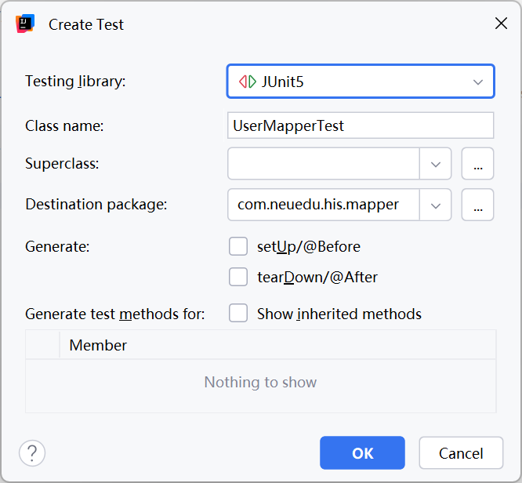


测试类

注意下 属性和字段的映射是否有大小写区分


```java
package com.neuedu.his.mapper;

import com.neuedu.his.po.User;
import org.junit.jupiter.api.Test;
import org.springframework.beans.factory.annotation.Autowired;
import org.springframework.boot.test.context.SpringBootTest;

import java.util.List;

import static org.junit.jupiter.api.Assertions.*;

/**
 * 作者: 张金山
 * 创建时间：2025/6/25 9:14   星期三
 * 描述：
 * 项目: his-server - com.neuedu.his.mapper
 * 作者的博客:  https://blog.fulfill.com.cn
 */
@SpringBootTest
class UserMapperTest {
    //AUtowire  从spirng  IOC中获取一个  Useraper
    @Autowired
    private UserMapper userMapper;


    @Test
    public void test(){

      //查询结果
      List<User> users = userMapper.selectList(null);
      users.forEach(System.out::println);

    }


}
```

测试结果

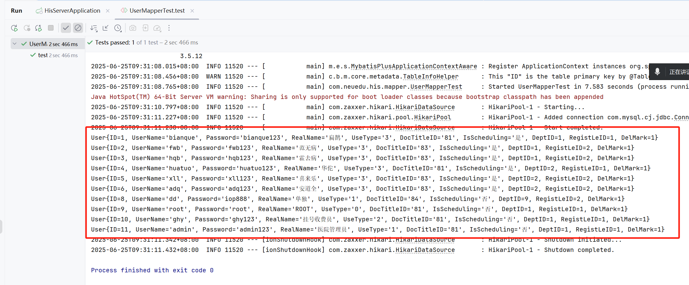

# MyBatisPlus持久层接口

## 查询集合

- List<T> selectList(@Param(Constants.WRAPPER) Wrapper<T> queryWrapper);

[条件构造器 | MyBatis-Plus](https://baomidou.com/guides/wrapper/)

```
  @Test
    public void test2() {

        //查询条件构造器
        LambdaQueryWrapper<User> queryWrapper = new LambdaQueryWrapper<>();


        // queryWrapper.like("username","admin");    //  usernmae  like  '%admin%'
        // queryWrapper.likeLeft("username","admin");  //  usernmae  like  '%admin'
        // queryWrapper.likeRight("username","admin");  //  usernmae  like  'admin%'

        queryWrapper.eq(User::getID,1);    //  where ID = 1

        // queryWrapper.between("age",18,20);


        // 查询结果
        // select * from user where  id = ?   username like ?
        List<User> users = userMapper.selectList(queryWrapper);
        users.forEach(System.out::println);


    }
```

## 查询单条

```java
@Test
public void selectById() {
    System.out.println("查询单条");
    Long id = 1L;
    User user = userMapper.selectById(id);
    System.out.println("user = " + user);
}
```

## 插入单条数据

```java
  @Test
    public void insert() {


        //模拟从用户界面录入数据
        User user = new User();

        user.setUserName("MyBatis");
        user.setPassword("123456");
        user.setRealName("MyBatis");
        user.setDeptID(1);
        user.setDelMark(1);

        int count = userMapper.insert(user);
        System.out.println("count = " + count);
    }

```

## 更新

根据主键更新  

```
update  xxx set  column = vlaue  where  主键 = ？
```

```java
@Test
public void updateById() {

    Long id = 13L;
    User user = userMapper.selectById(id);
    user.setPassword(user.getPassword()+"#$%&");
    user.setRealName(user.getRealName()+"----");
    // 全量字段更新 
    int count = userMapper.updateById(user);

    System.out.println("count = " + count);
}
```


## 删除

```java
@Test
public  void deleteById() {
    Long id = 13L;
    int count =  userMapper.deleteById(id);
    System.out.println("count = " + count);
}
```

# MyBaitsX

从数据库逆向生成 源代码，实体类、Mapper.java  Mapper.xml   Service  ServiceImpl

安装插件

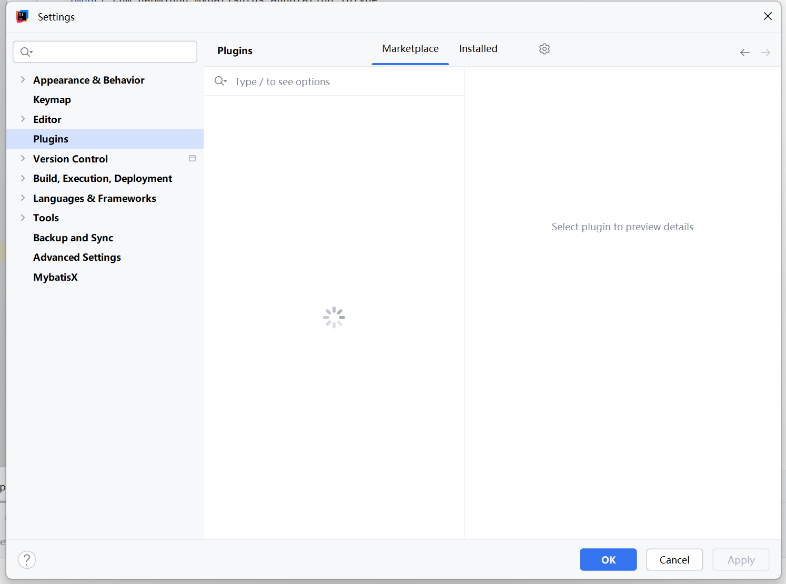

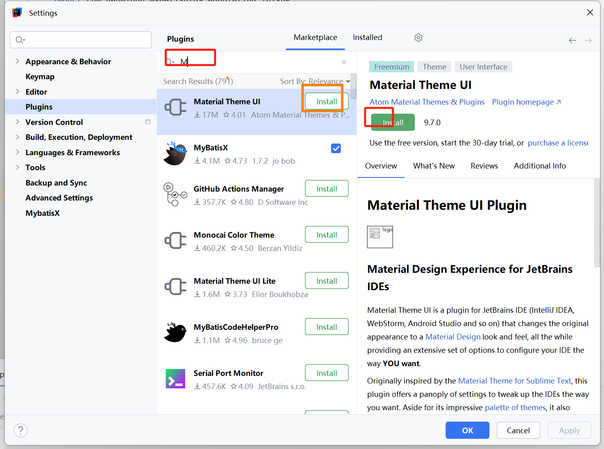

需要重新启动IDEA

## 使用MyBatisX

## 新建数据源

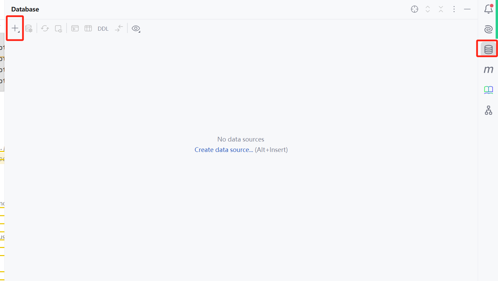


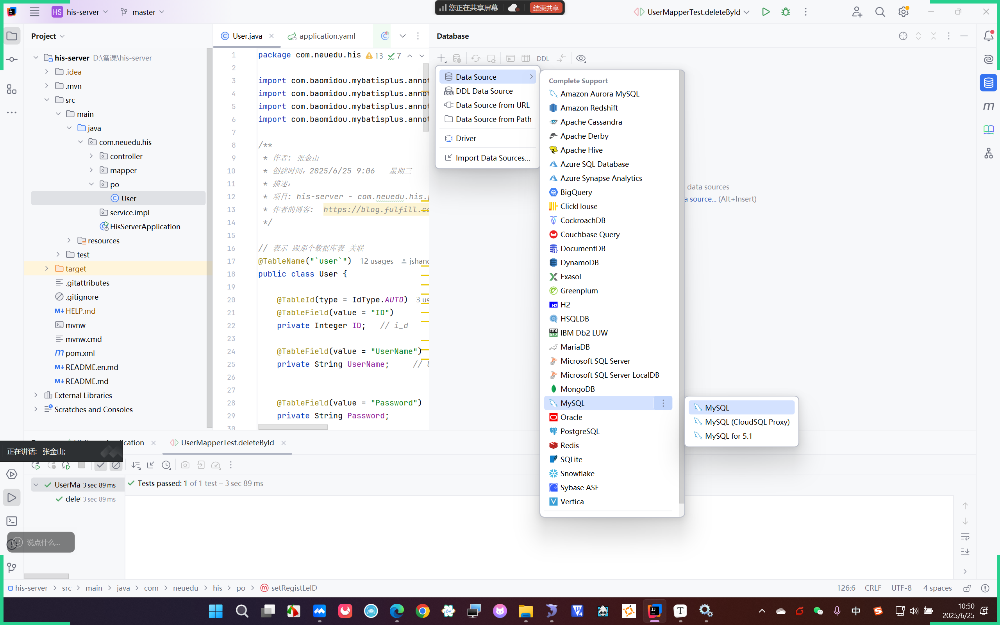

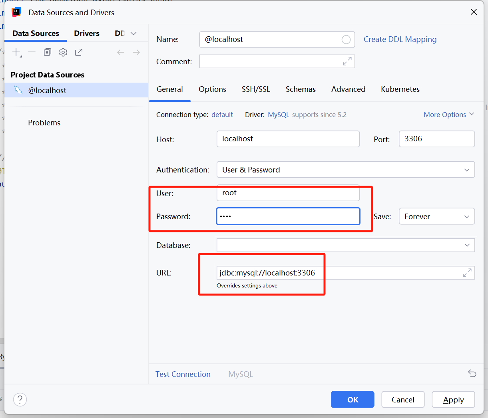


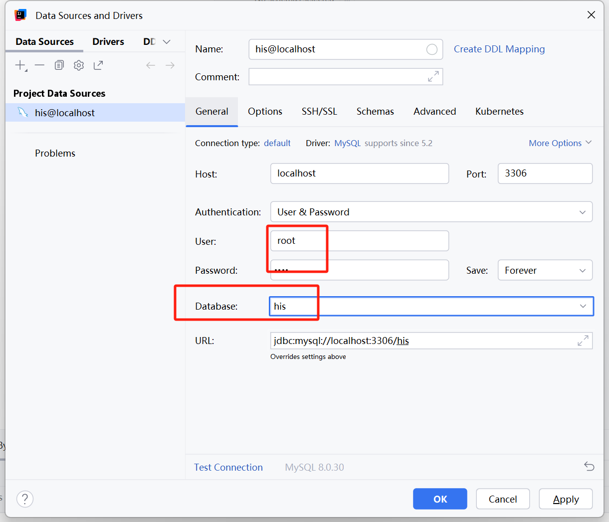

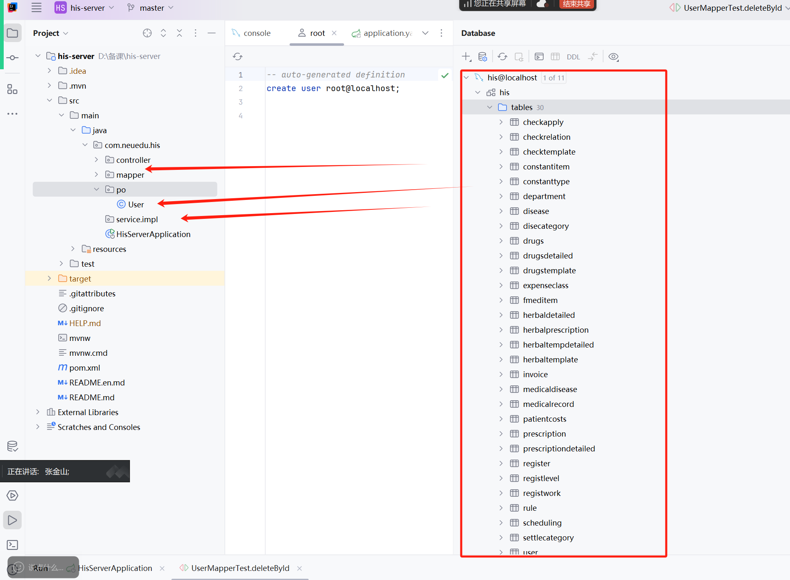


## 生成代码

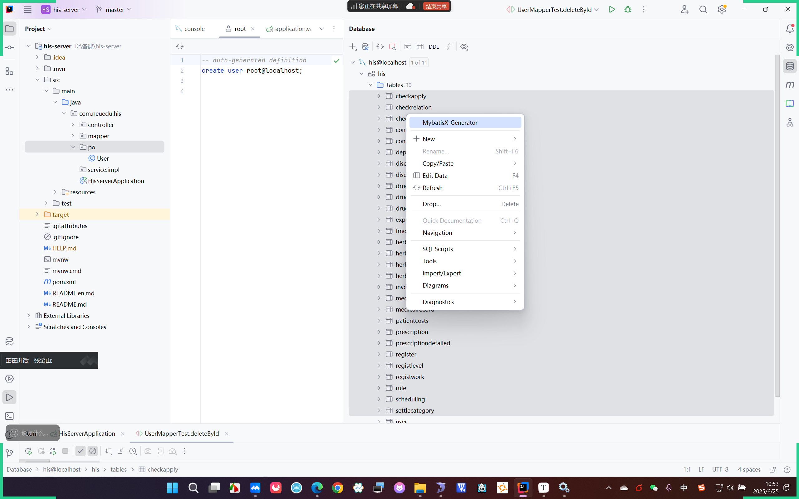

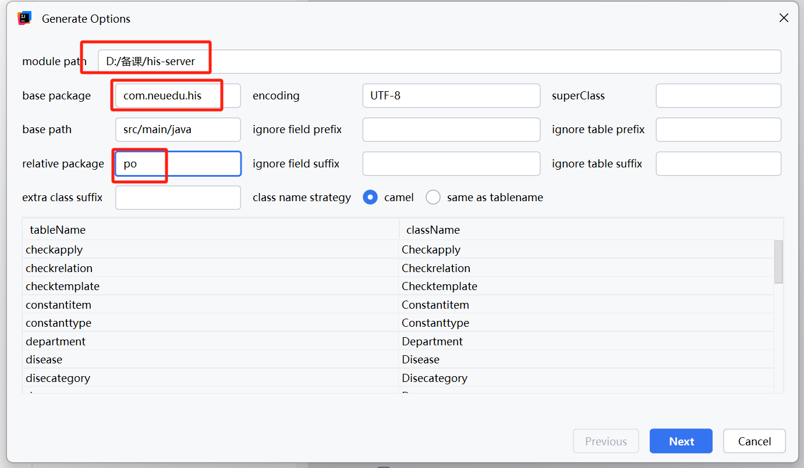

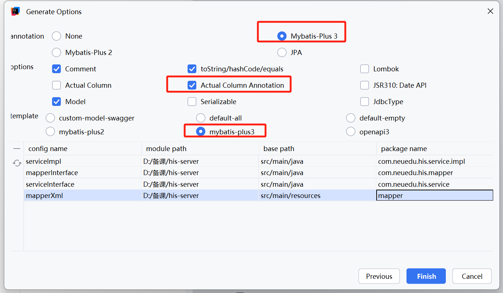

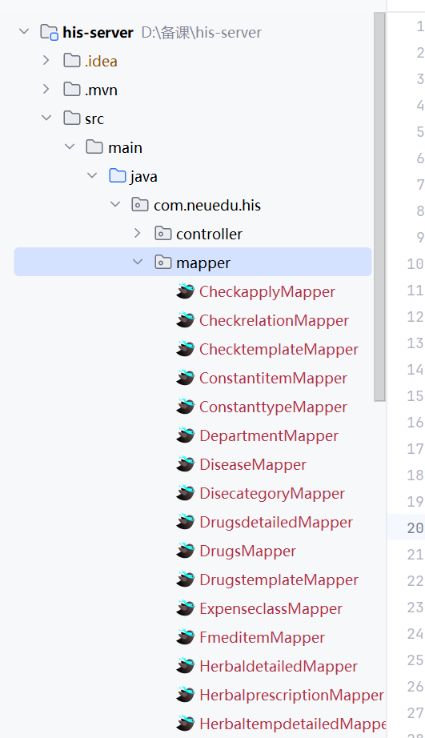

## 对生成的代码进行测试

```java
package com.neuedu.his.mapper;

import com.neuedu.his.po.Drugs;
import org.junit.jupiter.api.Test;
import org.springframework.beans.factory.annotation.Autowired;
import org.springframework.boot.test.context.SpringBootTest;

import java.util.List;

import static org.junit.jupiter.api.Assertions.*;

/**
 * 作者: 张金山
 * 创建时间：2025/6/25 10:58   星期三
 * 描述：
 * 项目: his-server - com.neuedu.his.mapper
 * 作者的博客:  https://blog.fulfill.com.cn
 */
@SpringBootTest
class DrugsMapperTest {

    @Autowired
    private DrugsMapper drugsMapper;


    @Test
    public void test(){
        List<Drugs> drugs = drugsMapper.selectList(null);
        drugs.forEach(System.out::println);
    }

}
```

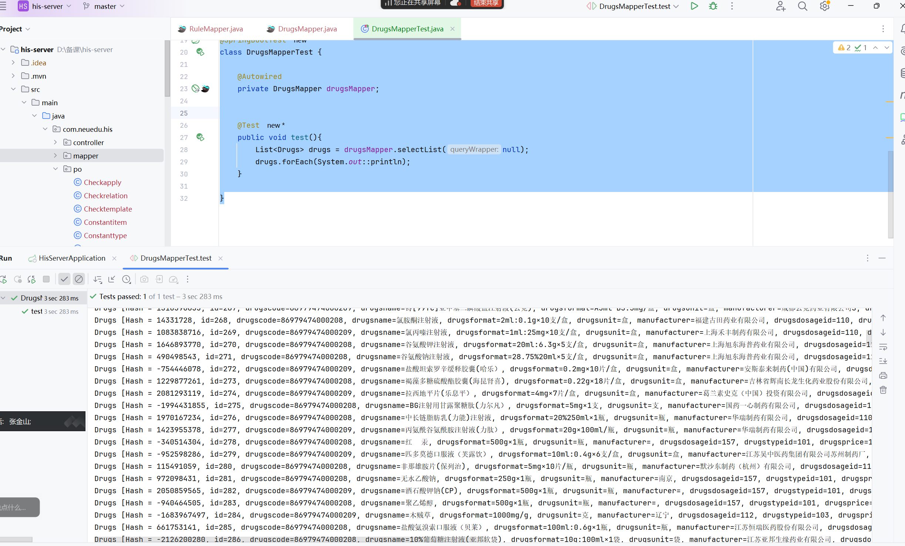


# 分页查询

添加依赖

```xml
 <!-- 3.5.9+的 MP 将分页功能单独拆开了。 -->
        <dependency>
            <groupId>com.baomidou</groupId>
            <artifactId>mybatis-plus-jsqlparser</artifactId>
            <version>3.5.12</version>
        </dependency>

```


# 使用Axios 

在前端基于Ajax发起网络请求，访问后端接口（获取数据），渲染用户列表

## 在前端项目中安装  axios  

安装镜像:

[新建标签页](http://npmmirror.com/)

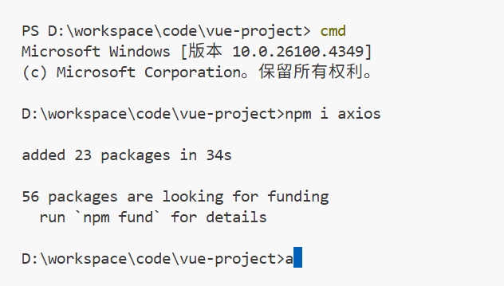


# Vue的生命周期

[生命周期钩子 | Vue.js](https://cn.vuejs.org/guide/essentials/lifecycle.html)

# 跨域的问题

前段： http://localhost:5173/user

网络请求： http://localhost:8080/user/list

设置允许跨域:

```java
package com.neuedu.his.config;

import org.springframework.beans.factory.annotation.Autowired;
import org.springframework.context.annotation.Configuration;
import org.springframework.web.servlet.config.annotation.CorsRegistry;
import org.springframework.web.servlet.config.annotation.InterceptorRegistry;
import org.springframework.web.servlet.config.annotation.WebMvcConfigurer;

@Configuration
// @EnableWebMvc
public class WebConfig implements WebMvcConfigurer {


    /**
     * 设置允许跨域
     *
     * @param registry
     */
    @Override
    public void addCorsMappings(CorsRegistry registry) {

        registry.addMapping("/*/**")
                .allowedOrigins("*")
                .allowedMethods("*")
                .maxAge(3600);

        // Add more mappings...
    }


}
```


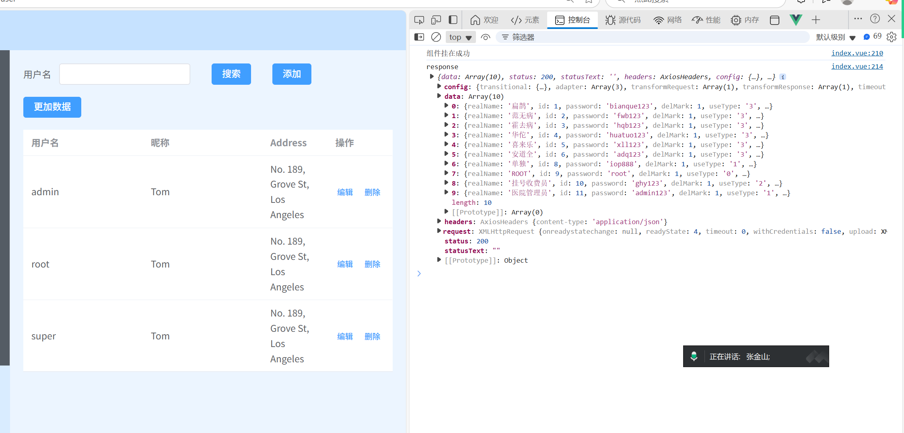


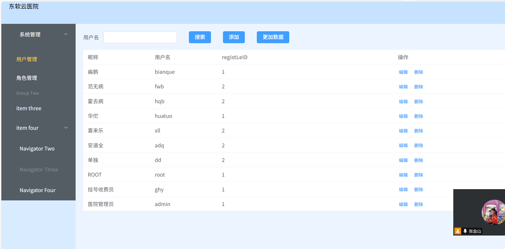


# 封装统一请求 

- utils/request.js

```js
import axios  from 'axios'

const service  = axios.create({
    baseURL:'http://localhost:8080'
})


export default service;
```

# 完成CRUD


> 详见代码
>
> 详见代码
>
> 详见代码
>
> 


## 添加

- 实现添加的接口

- 完成表

### 接口程序

UserController

```java
/**
 *  添加后修改
 * http://localhost:8080/user/saveOrUpdate
 * @return
 */
@RequestMapping("/saveOrUpdate")
public boolean saveOrUpdate(User user){
   boolean success = userService.saveOrUpdate(user);

    return success;
}
```

> 详见代码
>
> 详见代码
>
> 详见代码
>
> 


# 版本控制工具

[Git工具使用 | 金山老师的笔记](https://blog.fulfill.com.cn/course/01-java/git.html)

- 分支(Branch): 在一个时间点，复制一份处于版本控制之下的文件，从这之后，这两份拷贝就可以独立的互不干扰的进行各自开发。
- 取出(Check-out): 一次“取出”，就是在本地创建一份仓库的工作拷贝。
- 提交(Commit): 一次“提交”，将本地的修改写回到仓库或合并到仓库。
- 冲突(Conflict): 当开发者们同时提交对同一文件的修改，而且版本系统不能把它们合并到一起，就会引起冲突，就需要人工来进行合并。
- 合并(Merge): 合并就是把所有对文件的修改统一到文件里
- 仓库(Repository): 仓库就是当前的和历史的处于版本控制之下的文件所在的地方，通常在服务器端。
- 工作版本（Working copy）：从档案库中取出一个本地端的复制，所有在档案库中的档案更动，都是从一个工作版本中修改而来的，这也是这名称的由来。

## 操作

设置一个全局的身份信息

```shell
git config --global user.name "xxxxx"
git config --global user.email "xxxxxxxxx"
```

创建仓库

```
# 创建一个文件
root@root MINGW64 /d/workspace/code/myproject
$ touch a.txt

# 初始化一个仓库
root@root MINGW64 /d/workspace/code/myproject
$ git init
Initialized empty Git repository in D:/workspace/code/myproject/.git/


# 查看仓库状态
root@root MINGW64 /d/workspace/code/myproject (master)
$ git status
On branch master

No commits yet

Untracked files:
  (use "git add <file>..." to include in what will be committed)
        a.txt

nothing added to commit but untracked files present (use "git add" to track)

# 添加文件到git 版本控制工具中
root@root MINGW64 /d/workspace/code/myproject (master)
$ git add  .

# 查看状态
root@root MINGW64 /d/workspace/code/myproject (master)
$ git status
On branch master

No commits yet

Changes to be committed:
  (use "git rm --cached <file>..." to unstage)
        new file:   a.txt

# 提交到本地仓库
root@root MINGW64 /d/workspace/code/myproject (master)
$ git commit -m 'first commit '
[master (root-commit) 88a6bc6] first commit
 1 file changed, 0 insertions(+), 0 deletions(-)
 create mode 100644 a.txt

# 查看提交日志
root@root MINGW64 /d/workspace/code/myproject (master)
$ git log
commit 88a6bc6c974a391f3dccc81d954e0814aeffcccd (HEAD -> master)
Author: jshand <zhangjinshan21f@163.com>
Date:   Fri Jun 27 08:59:46 2025 +0800

    first commit

root@root MINGW64 /d/workspace/code/myproject (master)
$

```

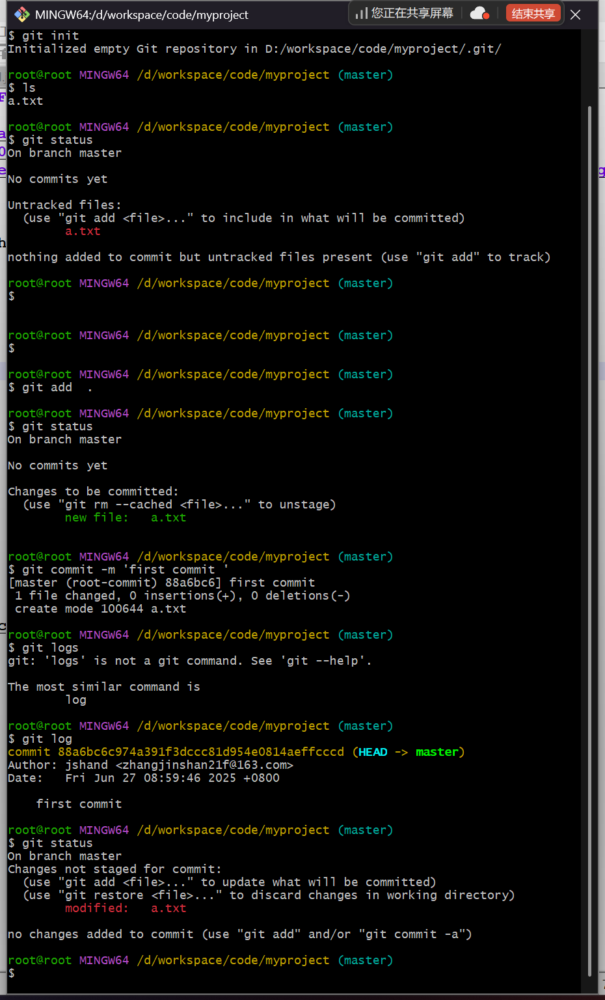


## 中央版本库管理

- gitlab
- Github
- Gitee

## gitee 注册

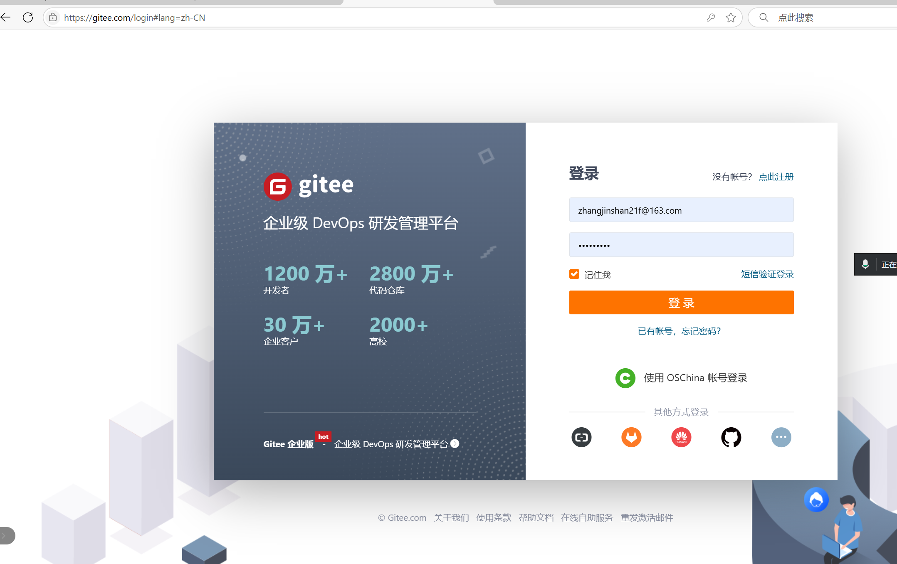

## 操作的形式


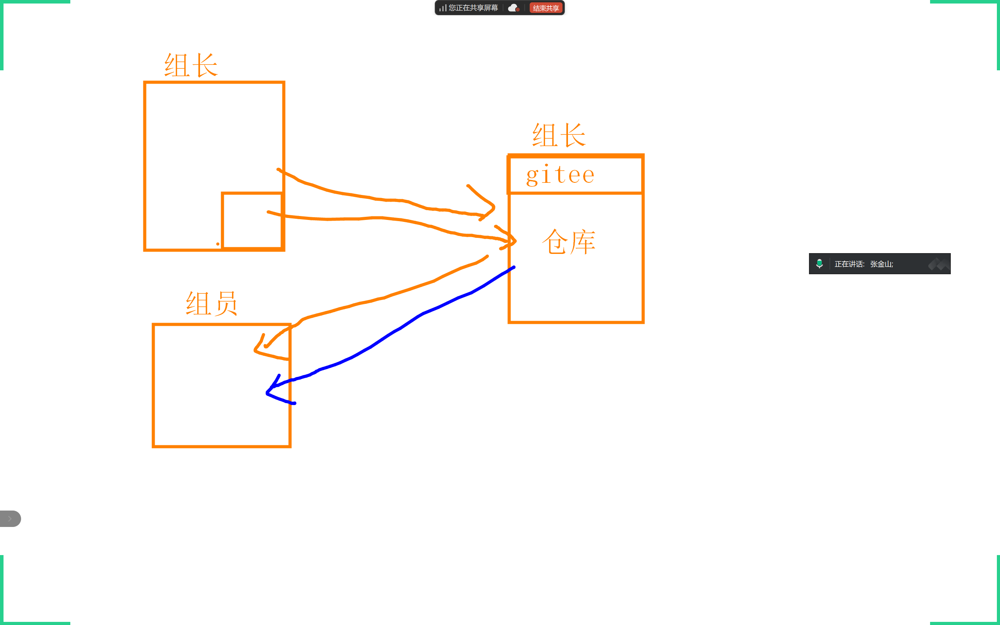

组长讲本地搭建好的项目提交到 服务器上

## 在gitee 上创建仓库

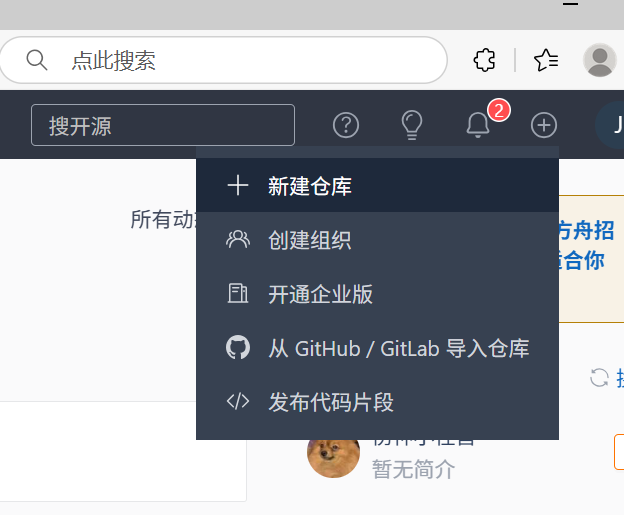

创建仓库

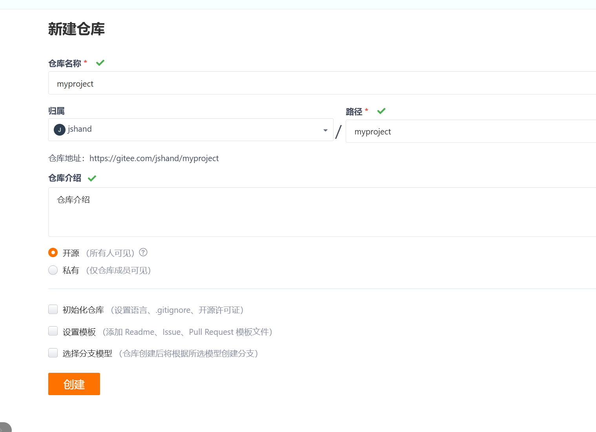


## 添加远端仓库

```shell
# 添加远端仓库  地址需要变化
git remote add origin https://gitee.com/jshand/myproject.git
# 提交到远端仓库
git push -u origin "master"

```


## 模拟不同身份员工之间的 代码合并

- 组长工作在： D:\workspace\code\myproject
  - 组长已经讲代码提交到：https://gitee.com/jshand/myproject
- 组员：    D:\workspace\code2

### 组长将成员添加到项目

添加完用户，组员才能操作项目

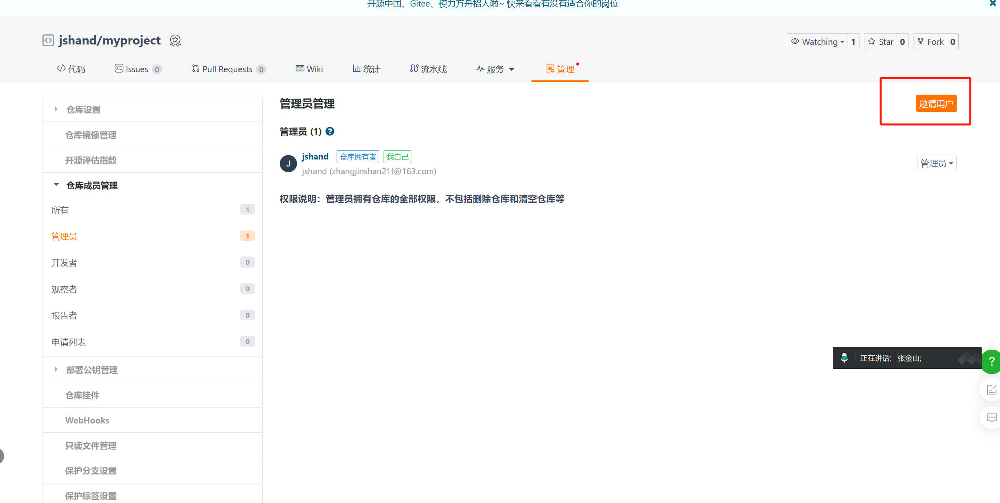


### 组员拉取项目

```bash
root@root MINGW64 /d/workspace/code2
$ git clone https://gitee.com/jshand/myproject.git
Cloning into 'myproject'...
remote: Enumerating objects: 3, done.
remote: Counting objects: 100% (3/3), done.
remote: Total 3 (delta 0), reused 0 (delta 0), pack-reused 0 (from 0)
Receiving objects: 100% (3/3), done.

root@root MINGW64 /d/workspace/code2
$ ls
myproject/


# 进入到项目目录
root@root MINGW64 /d/workspace/code2
$ cd myproject/


# 创建新文件
root@root MINGW64 /d/workspace/code2/myproject (master)
$ touch b.txt

# 向文件中输入内容
root@root MINGW64 /d/workspace/code2/myproject (master)
$ echo 'abc'>> b.txt

# 添加到暂存区
root@root MINGW64 /d/workspace/code2/myproject (master)
$ git add b.txt
warning: in the working copy of 'b.txt', LF will be replaced by CRLF the next time Git touches it

# 提交到本地仓库
root@root MINGW64 /d/workspace/code2/myproject (master)
$ git commit -m '模拟其他组员提交代码'
[master 74140bf] 模拟其他组员提交代码
 1 file changed, 1 insertion(+)
 create mode 100644 b.txt


# 将本地修改记录 push  推送到远端仓库
root@root MINGW64 /d/workspace/code2/myproject (master)
$ git push
Enumerating objects: 4, done.
Counting objects: 100% (4/4), done.
Delta compression using up to 20 threads
Compressing objects: 100% (2/2), done.
Writing objects: 100% (3/3), 310 bytes | 310.00 KiB/s, done.
Total 3 (delta 0), reused 0 (delta 0), pack-reused 0 (from 0)
remote: Powered by GITEE.COM [1.1.5]
remote: Set trace flag c4433ca3
To https://gitee.com/jshand/myproject.git
   88a6bc6..74140bf  master -> master

root@root MINGW64 /d/workspace/code2/myproject (master)
$

```

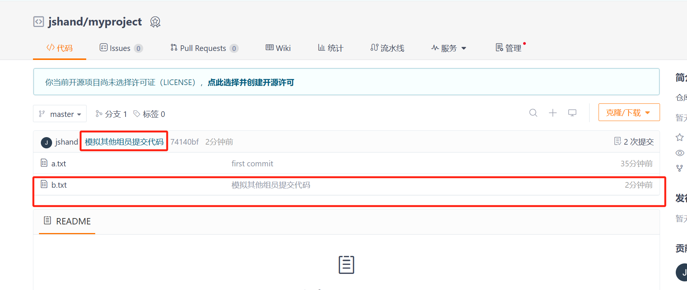

### 其他员工拉取新的代码

**git pull** 

```bash
root@root MINGW64 /d/workspace/code/myproject (master)
$ git pull
remote: Enumerating objects: 4, done.
remote: Counting objects: 100% (4/4), done.
remote: Compressing objects: 100% (2/2), done.
remote: Total 3 (delta 0), reused 0 (delta 0), pack-reused 0 (from 0)
Unpacking objects: 100% (3/3), 290 bytes | 14.00 KiB/s, done.
From https://gitee.com/jshand/myproject
   88a6bc6..74140bf  master     -> origin/master
Updating 88a6bc6..74140bf
Fast-forward
 b.txt | 1 +
 1 file changed, 1 insertion(+)
 create mode 100644 b.txt

root@root MINGW64 /d/workspace/code/myproject (master)
$ ls
a.txt  b.txt

root@root MINGW64 /d/workspace/code/myproject (master)
$

```


